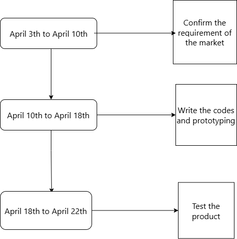

# Abstract

This is a 3D-FPS game based on `Unity`. The version of `Unity` is `2021.3.35f1`.

# Development Process: Agile

For a simple 3D FPS game and a student project, using **Agile** as the development process is a suitable choice due to its flexibility and iterative workflow. Agile allows for continuous improvement, frequent testing, and better collaboration throughout the development life cycle.

---

# Team & Responsbilities
### Team Roles  
| Name  | Responsibilities |  
|-------|------------------|  
| Morty(p2321396/COMP)|Character,Story Design,Demo Video |  
| Ashley(p2321339/COMP)|UI,Animation,Audio,Map Design|  
|William(p2320973/COMP)|Enemy Design,Level Design|

# The Introduction Video:
This is the [Introduction Video](https://youtu.be/oaDrheXLCi4) in YouTube.

# Schedule  
- April 3th to April 10th: Confirm the requirement of the market  
- April 10th to April 18th:Write the codes and prototyping
- April 18th to April 22th:Test the product

---
##  Schedule Chart

---

# Commits Descriptions

### on Apr 9, 2025
| Commits | Detail |
|----------|---------|
| Initial commit | Init |
| init a group project base on Unity | Init Unity group project |
| load Arts resources from Unity Store | Load Art resource |
### on Apr 9, 2025
| Commits | Detail |
|----------|---------|
| Upload Flow Chart & Structure diagram | Documentation |
| README.md Edit | Documentation Edit |
| Update README.md | Documentation Update |
| Update Team & Responsibility | Add Team & Responsibility |
| finish some basic scene loading | Add EnterScence |
| Merge pull request #1 from YuanAshley/main | Merge |
| Update README.md | Team & Responsibility Update, Add Schedule |
| Update README.md | Team & Responsibility Update |
| Upload new.drawio | Upload Schedule Timeline Graphic |
| Update README.md | Add Schedule Timeline Graphic |
| Update README.md | Schedule Timeline Graphic Update |
| schedule.drawio | Schedule Timeline Graphic Update |
| Upload schedule.drawio.png | Re-upload Schedule Timeline |
### on Apr 10, 2025
| Commits | Detail |
|----------|---------|
| Documentation Update | Upload Sequence diagram & Use case diagram, README.md Update |
| 3D & UI init | Prefabs Folder init |
| Merge pull request Hannnine#2 from YuanAshley/main | Merge |
| Update schedule.drawio.png | Schedule Timeline Graphic Update |
### on Apr 12, 2025
| Commits | Detail |
|----------|---------|
| finished the prefab of 'player' and built the basic scene of easy model | Upload some Gameplay files of Prefabs, Basic Level Design (EasyFLoor01) & Scripts |
| merge others | Merge |
| Prefabs | Finish 3D&UI of Prefabs |
| Merge | Merge |
| Merge pull request Hannnine#3 from szyszyszy416/main | Merge |
| Merge pull request Hannnine#4 from YuanAshley/main | Merge |
| Gameplay Complete | Finish Gameplay of Prefabs |
| Merge pull request Hannnine#5 from YuanAshley/main | Merge |
| finishe all the scene of different Level | Finish Level Design |
| merge commit | Merge |
###  on Apr 13, 2025
| Commits | Detail |
|----------|---------|
| Add plugins and finished the pickup scripts |  |
### on Apr 14, 2025
| Commits | Detail |
|----------|---------|
| finished all this Project |  |
| build the environment and release the game |  |
### on Apr 18, 2025
| Commits | Detail |
|----------|---------|
| Update README.md| Add Commits Descriptions Table|
### on Apr 21, 2025
| Commits | Detail |
|----------|---------|
| Update README.md| Add Video links and plugin references |
---

# Graphical Abstract

## 1. Flow Chart

The following flow chart illustrates the gameplay process that the player will experience. It also demonstrates the core design advantages of our game, such as **Hero & Difficulty Selection** and **Diary Events (Background Story)**.

> 💡 If the player is only interested in action, the game can be played as a pure shooting game. However, those who are curious about the narrative and world-building can explore hidden story elements through scattered diaries. These diaries are triggered under specific conditions.

---

## 2. Structure Diagram

This diagram showcases the internal structure and components of the game. It outlines how the different modules interact and the planned implementation strategies.

> 🔧 The input system is designed to be compatible with various gaming devices.

---

## 3. Use Case Diagram

The use case diagram summarizes the scenarios that players may encounter. These are arranged in a sequence consistent with the flow chart mentioned above.

---

## 4. Sequence Diagram

This diagram illustrates the interactions between core components in detail, providing a clear view of the implementation logic and process flow.

---

# The plugins
This is the whole plugins and references which are used in game but not built by our members:
| Plugin | Author |
|----------|---------|
| Unity Input Sytem | @Unity Technologies |
| NodeCanvas | @Paradoxnotion|
| Low-Poly Medieval Market | @VanillaArt |
| Low_Poly Nature | @Oode Studios |
| Unity Learn - FPS Microgame - URP (Art material) | @Unity Technologies |

---
